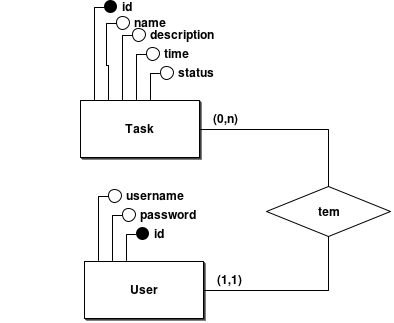
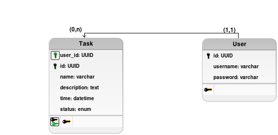

# Task Manager with NextJS

This is being done because I want to:
* Do some training with what I learned about Next
* Make this task manager to have a good usability to myself

Basically, I am doing that completly to me, with what I need to organize my daily tasks.

Here I will describe some things I think are interesting to be shown.

## Database
Choose to use SQL and postgresql because:
* I wanted to train it
* Data is very predictable and small, that means it is really easy and practical to organize them in the table model instead of the non-relational way to do it
* Postgresql is because I'm used to it and have no interest in use this project to interact with mySQL or any other SGBD

### ER

### Logic

## ORM
Initially, I would use vercel/postgres SDK to interact with the database, but, because of some limits of it, I decided to use Prisma ORM to learn about it.

